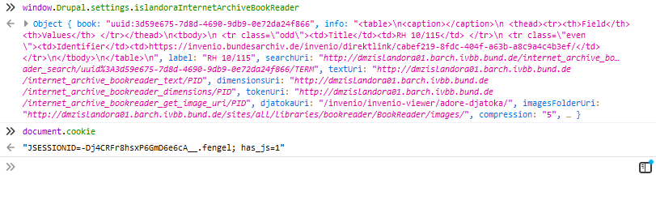

# BA-MA scraper
A method to download records from the BA-MA archives, brought to you by PanzerPlace. 
Although I have not found a Terms of Service explicitly forbidding the use of scrapers
on the BA-MA, systematic downloading of records may hamper the Militärarchive's services. 
Please use this application wisely and only download what you really need.

### Prerequisites
* Python3

### How to use this applciation
#### Step 1
Browse to the record you'd like to download. Once you see the record browser, right-click it and select "This Frame > Show Only This Frame".
After the page finishes loading, press F12 to open Developer Tools. Click the Console tab and
type `window.Drupal.settings.islandoraInternetArchiveBookReader`. An object is dumped to the console as response.
Right-click the object and select 'Copy Object'. Paste the contents to the `settings.json` file in the project directory.

#### Step 2
The settings you just copied contain tokens that are bound to your current Invenio session. Therefore, we need to make 
sure the scraper requests the images using the same session. For this we need to copy the cookies from your browser
to the application. To do this, first type a new command in the console: `document.cookie`. Again, right click the 
line that appeared and 'Copy Object'. Paste the content in the `cookie` file in the project directory. 

Example of what the console looks like after executing steps 1 and 2:

#### Step 3
Run `main.py`. You can do this via the command line using the command `python main.py`.
You will be asked to specify a range (start/end pages) which should be scraped. Pages will be downloaded
to a folder with the record's name. Each page also contains the record name as well as the page number.

### Notes and extras

The session validity on Invenio is very short. Normally, you'll get a pop-up every now and then which allows you to 
extend your session. Make sure to keep an Invenio window open and click OK in these pop-ups to keep your session alive.

#### Direct links to records
There is a neat trick to speed up loading records by creating direct links to them. For this you need to know the records UUID. 
The url looks like https://invenio.bundesarchiv.de/invenio/invenio-viewer/islandora/object/uuid%3A<records-uuid-here>. 

As an example, here is a direct link to RH 10/115: https://invenio.bundesarchiv.de/invenio/invenio-viewer/islandora/object/uuid%3A3d59e675-7d8d-4690-9db9-0e72da24f866

Note that, these links only work if you already logged-in (either as guest or user) to Invenio.